<p align="center">
  
</p>

<p align="center">
  <a href="https://ahsaan-portfolio.onrender.com"></a>
  <a href="mailto:ahsaanmunir53@gmail.com"></a>
  <a href="https://www.linkedin.com/in/YOUR-LINKEDIN"></a>
  
</p>

### About me

```js
const ahsaan = {
  role: "Full-Stack & AI Engineer",
  location: "Lahore, Pakistan",
  education: "BS Computer Science, UMT",
  now: [
    "MERN stack intern at Infotech (CMIT program)",
    "Remote engineer for a client in Germany",
  ],
  stack: {
    web: ["React", "Node.js", "Express", "MongoDB", "TypeScript"],
    backend: ["Python", "FastAPI", "Django", "PostgreSQL"],
    ai: ["RAG", "Voice agents", "ML models", "LLM APIs"],
  },
  shipped: "10 apps live in production",
  openTo: ["Full-time roles", "Freelance", "Collaborations"],
  contact: "ahsaanmunir53@gmail.com",
};
```

I build products end to end: the React front end, the Node or Python API behind it, the database, and the AI part when there is one. Most of my apps are live and used by real people, including a production site for a client. I care about the parts nobody sees too, like confirming payments on the server and switching off the camera when a page closes.

### Featured work

| Project | What it does | Built with | |
|---|---|---|---|
| **Fatima Hope** | Production website for a psychological care organisation; their team updates content through an admin panel | React, TypeScript, Node, Express | [Live](https://www.fatima-hope.org) |
| **MAHRU** | Online store with Stripe checkout, a role-based admin and order management | MongoDB, Express, React, Node, Stripe | [Live](https://mahru-store.onrender.com) |
| **Sign Bridge** | Turns Urdu sign language into text in real time (40 signs), with a 3D avatar that signs words back | React, Express, MongoDB, Flask, MediaPipe | [Code](https://github.com/ahsaanmunir53/Real-Time-Urdu-Sign-Language) |
| **DocMind** | Ask questions about your documents; hybrid keyword and vector search, and every answer cites its page | Django, RAG | |
| **Monal AI** | Voice agent that answers phone calls in English and Urdu, with WhatsApp confirmations | Python, LLM APIs | |
| **LUMÉRA** | Salon website with services, pricing and live booking | React, Node | [Live](https://lumera-salon.onrender.com) |
| **QAHVA** | Café website with online ordering; the owner manages the menu himself | React, Node | [Live](https://qahva-cafe.onrender.com) |

<sub>The onrender.com sites run on free hosting and can take about 30 seconds to wake up.</sub>

### Tech stack

**Frontend**<br/>


**Backend**<br/>


**Data, AI and tools**<br/>


### Contributions

<picture>
  <source media="(prefers-color-scheme: dark)" srcset="https://raw.githubusercontent.com/ahsaanmunir53/ahsaanmunir53/output/github-snake-dark.svg" />
  
</picture>

---

<p align="center">Open to full-time roles and freelance work. Email is the fastest way to reach me.</p>
